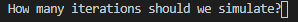
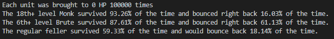

# Pet Projects
This repository was created when I first began learning Python and was intended to contain my little pet projects to mess around for fun or solve problems related to my hobbies.  Data Analysis with Python dominated more of my free time than I expected once the ball got rolling so right now there is but one project.

## **Brute Death Saving Throws:**
I created this little program to answer a difficult statistical question related to Dungeons and Dragons.  When you run it you are prompted with a query asking:

 
(100,000 iterations gives results consistently within about 0.5 percent and only takes a couple seconds to run)

It then prints these strings to the console:

 

But what is this actually saying?

This program simulates the 'Death Saving Throws' of three different charachters and logs their outcomes.  The three types of characters are:
 - A Monk who has achieved at least 18 levels of Monk
 - A Fighter/Brute who has achieved at least 6 levels of Fighter
 - A 'regular feller'  who has no bonuses or alterrations to their 'Death Saving Throws' which represents the case for an overwhelming majority of class/subclass combos.

 When you perform 'Death Saving Throws' there are these three possible ultimate outcomes, listed in order of probability of a normal character:
  1. You can resist death, but remain unconscious until sufficient time has passed or you are healed
  2. You can die
  3. You can resist death and immediately regain consciousness with a single Health Point (HP)

The output shows the percentage of each outcome for each type of character, making it easy to compare the outcomes that potential changes to conditions actually translate to.

### **Why simulate rather than calculate?**

Calculating the exact odds of any given outcome for each type of 'Death Saving Throws' would be an incredibly error-prone and time-consuming process.  So like most of my statistician peers, once a certain number of layers of complexity is achieved I err on the side of simulations rather than calculations.  Hence the existence of this program.  I could have additionally wtirren a program which gives me an exact answer, but the simplest way of doing this would have used an obscene amount of RAM and taken longer than running this program for 100,000,000 calculations, which gives an equally useful answer.

### **Background:**

If you're unfamiliar, Dungeons and Dragons (D&D) is a tabletop role-playing game.  Players make choices and roll dice to simulate the inherent randomness of the universe. They then add their characters bonuses to the roll, representing the effect a characters skill and ability plays in the scenario.

Every now and then the creators release iterations of an article called 'Unearthed Arcana' (UA) which proposes changes to the game, which people can playtest and give feedback on.  It is difficult to determine the overall balance of a proposed change through playtesting, however, as some games of D&D go on for months or years.  Significant imbalances might be noticible right away but there simply is not enough time to playtest enough times to get a good answer in a reasonable amount of time. This is why mathematical/statistical analysis is so prevalent in the community.  Dice randomness is easy to tackle mathematically and you can often get a quick and exact mathematical answer as to the change in probability of significant events.

Sometimes, however, this is not the case.  As was the case with the bonuses to 'Death Saving Throws' of the proposed Fighter subclass, 'the Brute.'

See, when a character is reduced to 0HP for some reason they fall unconscious and go through the process of making their 'Death Saving Throws.' Here are the steps:

1. You roll a 20 sided dice (d20)
2. Check the outcome:
     - If the dice roll is >= 10 you pass a single death save.
     - If the dice roll is < 10 you fail a single death save.
     - If the dice roll is a 'natural 20' (meaning that you rolled a 20 on the die rather than adding up to 20 after applying bonuses to the roll) you 'bounce back' meaning you immediately regain consciousness and gain 1HP
     - If the dice is a 'natural 1' you fail ***two*** death saves
3. Unless you have 'bounced back' you tally your death saves:
     - If you have accumulated 3 passes, you stop making death saves but remain unconscious.
     - If you have accumulated at least 3 fails, you die.
     - If you have neither accumulated 3 passes or fails, you make another 'death save' on your next turn.

You can see how this might be time-consuming to determine exact odds using pure math. You roll anywhere from 1 - 5 times, and depending on the outcomes and sequence of outcomes a few different things can happen, most-often you re-do the roll again with different conditions defined by the outcome of the first roll.

But wait.. Theres more!
A Monk at 18th level adds their proficiency to their death saves (always +6 by the time they're 18th level.) This increases the odds of accumulating 3 passes and reduces the odds of accumulating 3 fails.  It doesn't *directly* alter the odds of 'bouncing back' as it doesn't affect the odds of rolling a nat 20.  It does, however, indirectly reduce the odds of 'bouncing back' as it reduces the average number of times you need to roll Death Saves, thereby less opportunities to roll a 20.  This doesn't make the math more complicated, but it does mean it needs to be run again with different numbers.

**Now the proposed 'Brute':**
 
The Brute rolls a six-sided die (d6) in addition to the d20, adding 6 new possible roll totals and changing the odds of every other roll total.  In addition, they have an addendum by which, if the d20 plus the d6 adds up to 20 or more, you apply the benefits of a natural 20, also affecting the odds of bouncing back.

Hopefully by now you see with crystal clarity why simulation is, at the very least, a highly-competitive approach compared to calculation.
